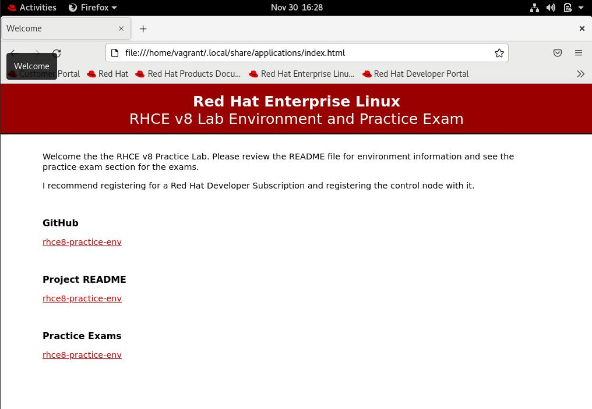

# rhce8-practice-env

An RHCE v8 lab enviroment with practice exams.



This repo contains Vagrant and Ansible code that will help you setup a lab environment and practice for the RHCE v8 exam.

The lab environment consists of 1x control node (RHEL server with GUI), one local repo server, and 4x additional nodes.

+ control
+ repo
+ node1
+ node2
+ node3
+ node4

## Setting Up the Environment

See the [Setup](./Setup.md) page for details instructions on how to install and configure the environment.

## Environment Info

### Vagrant Boxes

+ Nodes - [victorbrca/rhel84](https://app.vagrantup.com/victorbrca/boxes/rhel84)
+ Control - [victorbrca/rhel84-gui](https://app.vagrantup.com/victorbrca/boxes/rhel84-gui)
+ Repo - [rdbreak/rhel8repo](https://app.vagrantup.com/rdbreak/boxes/rhel8repo)

### Users

**User:** vagrant
**Password:** vagrant
**Sudo access:** yes

### Network

+ **control**
  + control.ansi.example.com
  + 192.168.55.200
  + Gateway - 192.168.55.1
  + DNS - 8.8.8.8
+ **node1**
  + node1.ansi.example.com
  + 192.168.55.201
  + Gateway - 192.168.55.1
  + DNS - 8.8.8.8
+ **node2**
  + node2.ansi.example.com
  + 192.168.55.202
  + Gateway - 192.168.55.1
  + DNS - 8.8.8.8
+ **node3**
  + node3.ansi.example.com
  + 192.168.55.203
  + Gateway - 192.168.55.1
  + DNS - 8.8.8.8
+ **node4**
  + node4.ansi.example.com
  + 192.168.55.204
  + Gateway - 192.168.55.1
  + DNS - 8.8.8.8
+ **repo**
  + repo.ansi.example.com
  + 192.168.55.199
  + Base and AppStream repos are available via:
    + `http://repo.ansi.example.com/BaseOS`
    + `http://repo.ansi.example.com/AppStream`

### Vagrant Commands

Use the commands below to control your environment with Vagrant:

+ `vagrant up` - Boots and provisions the environment
+ `vagrant destroy -f` - Shuts down and destroys the environment
+ `vagrant halt` - Only shuts down the environment VMs (can be booted up with `vagrant up`)
+ `vagrant suspend` - Puts the VMs in a suspended state
+ `vagrant resume` - Takes VMs out of a suspended state

> [!NOTE]
> + The first time you run `vagrant up` it will download the box (VM image), so it will take a while. After that, recreating the VMs will be quicker as the images will already be local to your machine.
> + Once the VMs are created you can also use the VirtualBox Manager to control the VMS.

### Reseting the environment

Use `vagrant destroy -f` and `vagrant up` to recreate the environment. You can also recreate a specific image by providing the node to the two commands, and then running the build playbook limiting that machine on the control node. 

For example:

```bash
cd /vagrant
ansible-playbook playbooks/build-nodes.yml --limit node1
```

### Accessing the systems

You can access the systems using `vagrant ssh [vm name]`:

Example:

```
vagrant ssh node1
```

Via the Virtual Box Manager, or you can ssh to the VM using your systems built-in SSH client:

```
ssh vagrant@192.168.55.201
```

>[!tip]
> Add the IP addresses to your local host file if you want to connect to the guest systems with the hostname.

## Practice Exams

A few practice exams are included. See the [Practice Exams](./practice_exams/README.md) page.

## Exam Material

A collection of information for the RHCE v8 exam. See the [Exam Material](./ExamMaterial.md) page.

## Red Hat Developer Program (FREE RHEL Licenses)

I highly recommend registering your control node (or all nodes) using **free** RHEL licenses that are provided with the Red Hat Developer Program (you can read more about it [here](https://developers.redhat.com/articles/faqs-no-cost-red-hat-enterprise-linux#)). By doing that, you will be able to run full updates by adding Red Hat official repos, and much more.

+ Register for the [Red Hat Developer Program](https://developers.redhat.com/register)
+ Register the control node to your new developer account using `subscritption-manager` (or using included playbooks - see below)
+ Optionally:
  + Enable the 'CodeReady Linux Builder' repo
  + Install/enable the EPEL repo

### Using Included Playbooks

Once you have your Red Had Developer subscription, you can also register the control node with included playbooks, either before the build, or after building the environment.

First add your Red Hat username and password to:

`roles/register-control-node/defaults/main.yml`

```yaml
---
# defaults file for register-control-node

username: ''
password: ''
```

Then use one of the two methods below.

#### Enabling control registration during build

Before building the environment, set the `register_control` variable to `true`:

`playbooks/build-nodes.yml`

```yaml
  vars:
    - register_control: true
```

Then run `vagrant up` as usual to build the environment.

#### After the environment is built

Run the playbook `register-control.yml` from the control node:

```bash
# ssh to the control node
vagrant ssh control

# Change into the /vagrant folder
cd /vagrant

# Run the playbook
ansible-playbook playbooks/register-control.yml
```

## Known Issues

### VT-x is not available. (VERR_VMX_NO_VMX)

Running the `vagrant up` environment build will fail If HyperV is installed on the Windows VirtualBox host.
Error is usually "VT-x is not available. (VERR_VMX_NO_VMX)" or similar, when the script attempts to boot the first VM.

Resolution seems to be either remove HyperV, or preventing its hypervisor from starting with the command below followed by a reboot:

```
bcdedit /set hypervisorlaunchtype off
```

### Could not create the medium storage unit (VERR_ALREADY_EXISTS)

The following error might appear when re-creating one or more VMs in VirtualBox:

```
Stderr: 0%...VBOX_E_FILE_ERROR
VBoxManage: error: Failed to create medium
VBoxManage: error: Could not create the medium storage unit 'rhce8env/disk-0-4.vdi'.
VBoxManage: error: VDI: cannot create image 'rhce8env/disk-0-4.vdi' (VERR_ALREADY_EXISTS)
```

If you have VirtualBox Manager open, check the disks in the 'Media' section and you might notice that a disk for a deleted VM is still listed. If the file itself doesn't exist, close the VirtualBox Manager and try running `vagrant up` again.

## Acknowledgements

This project is a fork of the [rdbreak/rhce8env](https://github.com/rdbreak/rhce8env) project with heavy customization.

Exam 1 is a variation of the of the [Lisenet: Ansible Sample Exam for RHCE EX294 and EX407](https://www.lisenet.com/2019/ansible-sample-exam-for-ex294/).
